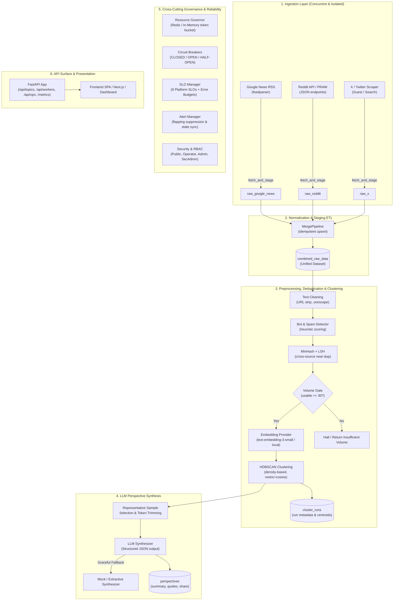

# VantageNews Backend Architecture & Technical Working Guide

## 1. Executive Summary & Core Mission

**VantageNews** is a real-time, multi-perspective news aggregation, clustering, and AI synthesis platform. Its core objective is to ingest public discourse surrounding trending topics from independent sources (Google News RSS, Reddit, and X/Twitter), eliminate noise, bots, and duplicate narratives, cluster similar viewpoints via dense vector embeddings and density-based clustering ($HDBSCAN$), and use Large Language Models (LLMs) to synthesize distinct perspectives with balanced representation, key arguments, and representative quotes.

The backend is built with **FastAPI** (Python), **SQLAlchemy** (PostgreSQL/SQLite), and an enterprise-grade reliability and observability suite (distributed resource governance, circuit breakers, multi-tier RBAC, automated alerting, and SLO tracking).

---

## 2. End-to-End System Architecture



---

## 3. Detailed Component Breakdown

### 3.1 Ingestion & Staging Layer (`backend/app/ingestion/`)
* **[`GoogleNewsIngestor`](file:///c:/Chirag/Code/Source/VantageNews/backend/app/ingestion/google_news.py)**:
  - Fetches RSS news feeds based on topic queries.
  - Sanitizes snippets and parses publish timestamps.
  - Writes directly to the staging table `raw_google_news`.
* **[`RedditIngestor`](file:///c:/Chirag/Code/Source/VantageNews/backend/app/ingestion/reddit.py)**:
  - Queries relevant subreddits using Reddit's search API / PRAW.
  - Extracts submission self-text, scores, comment counts, and metadata.
  - Writes directly to `raw_reddit`.
* **[`XScraper`](file:///c:/Chirag/Code/Source/VantageNews/backend/app/ingestion/x.py)**:
  - Collects public tweets, retweets, replies, and like metrics.
  - Writes directly to `raw_x`.
* **Fault Isolation & Concurrency**:
  - Orchestrated by **[`IngestionPipeline`](file:///c:/Chirag/Code/Source/VantageNews/backend/app/ingestion/pipeline.py)** using a `ThreadPoolExecutor`.
  - Each scraper runs in an isolated thread with its own scoped database session (`SessionLocal`), preventing transaction lockups.
  - If a single source fails or is rate-limited, remaining sources complete and merge without error.

---

### 3.2 Data Merging & ETL (`backend/app/ingestion/merge_pipeline.py`)
* **[`MergePipeline`](file:///c:/Chirag/Code/Source/VantageNews/backend/app/ingestion/merge_pipeline.py)**:
  - Extracts new rows from `raw_google_news`, `raw_reddit`, and `raw_x`.
  - Normalizes fields to match the `CombinedRawData` schema (`source`, `text_content`, `url`, `author_handle`, `engagement_metrics`, `created_at`).
  - Performs idempotent deduplication based on `(slug_id, source, text_content/external_id)`.
  - Computes and updates `Topic.source_coverage` (`google_news`, `reddit`, `x`, `total_combined`).

---

### 3.3 Discourse Preprocessing & Deduplication (`backend/app/processing/`)
* **[`DiscourseProcessor`](file:///c:/Chirag/Code/Source/VantageNews/backend/app/processing/processor.py)**: Coordinates text cleaning, bot filtering, and near-duplicate elimination.
* **[`TextCleaner`](file:///c:/Chirag/Code/Source/VantageNews/backend/app/processing/text_cleaner.py)**: Strips URLs, normalizes whitespace, unescapes HTML entities, and removes noise characters.
* **[`BotDetector`](file:///c:/Chirag/Code/Source/VantageNews/backend/app/processing/bot_detector.py)**:
  - Evaluates heuristic signals: excessive link density, promotional keywords, known spam patterns, repetitive username signatures, and extreme duplicate frequency.
  - Flags records with `is_flagged_bot = True` while preserving auditability.
* **[`MinHashLSH`](file:///c:/Chirag/Code/Source/VantageNews/backend/app/processing/minhash_lsh.py)**:
  - Generates MinHash signatures for shingled n-grams.
  - Uses Locality-Sensitive Hashing (LSH) with Jaccard similarity threshold (e.g. $\ge 0.75$) to detect cross-platform syndicated duplicates (e.g. identical press releases across multiple outlets).

---

### 3.4 Embeddings & HDBSCAN Clustering (`backend/app/processing/`)
* **[`BaseEmbeddingProvider`](file:///c:/Chirag/Code/Source/VantageNews/backend/app/processing/embeddings.py)**:
  - Generates dense vector representations using OpenAI (`text-embedding-3-small` / `text-embedding-ada-002`) or a local mock/fallback provider.
  - Applies $L_2$ vector normalization so Euclidean distances map directly to Cosine distance ($D_{cosine} = \frac{1}{2} D_{euclidean}^2$).
* **[`HDBSCANClusterer`](file:///c:/Chirag/Code/Source/VantageNews/backend/app/processing/clustering.py)**:
  - Performs density-based spatial clustering of applications with noise (HDBSCAN).
  - Dynamically calculates `min_cluster_size` based on dataset volume.
  - Automatically isolates outliers and noisy discourse into cluster `-1`.
  - Selects cluster exemplars/representatives (items closest to cluster medoid/centroid) to feed into the synthesis step.
* **[`ClusterPipeline`](file:///c:/Chirag/Code/Source/VantageNews/backend/app/processing/cluster_pipeline.py)**:
  - Persists execution metadata in the `cluster_runs` table (`cluster_algorithm`, `cluster_count`, `sample_size`, `run_at`).

---

### 3.5 LLM Perspective Synthesis (`backend/app/llm/`)
* **[`PerspectivePipeline`](file:///c:/Chirag/Code/Source/VantageNews/backend/app/llm/pipeline.py)**:
  - Sorts clusters by size and extracts the top $N$ representative discourse samples.
  - Truncates and budgets input tokens to enforce strict cost governance.
* **[`OpenAIPerspectiveSynthesizer`](file:///c:/Chirag/Code/Source/VantageNews/backend/app/llm/perspective.py)**:
  - Prompts LLM with structured schemas to produce:
    1. **Core Topic Summary**: Unbiased overview of the subject.
    2. **Perspectives**: Array of viewpoint objects containing `perspective_type`, `estimated_share`, `summary`, `key_arguments`, and `sample_quotes`.
    3. **Confidence Note**: Data quality and confidence assessment.
* **Graceful Degradation Fallback**:
  - If the LLM provider fails, times out, or hits a rate limit, the pipeline falls back to **`MockPerspectiveSynthesizer`**, synthesizing extractive key phrases without throwing 500 errors.
* **Database Upsert**:
  - Idempotently clears stale perspectives for the topic and persists new records in the `perspectives` table.

---

### 3.6 Background Workers & Automation (`backend/app/workers/`)
* **[`BackgroundScheduler`](file:///c:/Chirag/Code/Source/VantageNews/backend/app/workers/scheduler.py)**:
  - Thread-safe daemon loop running at configurable intervals (`WORKER_INTERVAL_SECONDS`).
  - Supports automatic topic trend discovery, periodic refreshing, and cleanup.
* **[`TrendDiscoveryService`](file:///c:/Chirag/Code/Source/VantageNews/backend/app/workers/discovery.py)**:
  - Scans external trend sources (Google Trends, Reddit hot topics) to identify emerging public discourse topics and register new candidate `Topic` rows.
* **[`TrendingScorer`](file:///c:/Chirag/Code/Source/VantageNews/backend/app/workers/trending.py)**:
  - Computes continuous `trending_score` ($0.0 \to 1.0$) based on search velocity, discourse freshness, cross-source diversity, and engagement volume.
* **[`TopicRefreshWorker`](file:///c:/Chirag/Code/Source/VantageNews/backend/app/workers/topic_refresh.py)**:
  - Selects active/trending topics that have exceeded stale thresholds and triggers an end-to-end cycle (`Ingest -> Merge -> Cluster -> Synthesize`).

---

### 3.7 Governance, Resilience & Observability (`backend/app/core/`)

| Subsystem | Module | Description |
| :--- | :--- | :--- |
| **Resource Governor** | [`resource_governor.py`](file:///c:/Chirag/Code/Source/VantageNews/backend/app/core/resource_governor.py) | Provides dual backend (`RedisGovernanceStore` & `InMemoryGovernanceStore`). Coordinates sliding-window rate limiters, token buckets, distributed concurrency slots with TTL leases, and cost accounting. |
| **Resilience & Fault Tolerance** | [`resilience.py`](file:///c:/Chirag/Code/Source/VantageNews/backend/app/core/resilience.py) | Implements Circuit Breakers (`CLOSED`, `OPEN`, `HALF_OPEN`), exponential backoff with full/decorrelated jitter, and `CancellationToken` propagation for long-running pipelines. |
| **SLO & Error Budget Engine** | [`slo.py`](file:///c:/Chirag/Code/Source/VantageNews/backend/app/core/slo.py) | Tracks 9 real-time platform SLOs (API availability, latency P95, pipeline success rate, DB query P95, worker heartbeats), calculates remaining error budget and multi-window burn rates. |
| **Automated Alerting** | [`alerting.py`](file:///c:/Chirag/Code/Source/VantageNews/backend/app/core/alerting.py) | Continuously evaluates metrics and circuit states; handles alert deduplication, cooldowns, flapping suppression, and automatic resolution recording to `operational_alerts`. |
| **Security & RBAC** | [`security.py`](file:///c:/Chirag/Code/Source/VantageNews/backend/app/core/security.py), [`audit.py`](file:///c:/Chirag/Code/Source/VantageNews/backend/app/core/audit.py) | 4-tier RBAC (`public`, `operator`, `admin`, `security_admin`), timing-safe key comparison (`hmac.compare_digest`), multi-stage SSRF defense with IP notation decoding, and immutable logging in `security_audit_logs`. |
| **Telemetry & Metrics** | [`metrics.py`](file:///c:/Chirag/Code/Source/VantageNews/backend/app/core/metrics.py), [`telemetry.py`](file:///c:/Chirag/Code/Source/VantageNews/backend/app/core/telemetry.py) | Low-cardinality counters, gauges, sliding-window percentile histograms ($P_{50}, P_{90}, P_{95}, P_{99}$), and Prometheus exposition on `/metrics`. |

---

## 4. Database Schema & Data Models (`backend/app/database/models.py`)

```text
┌────────────────────────────────────────────────────────┐
│                         Topic                          │
├────────────────────────────────────────────────────────┤
│ id, title, slug, search_count, trending_score,         │
│ source_coverage (JSON), last_clustered_at, updated_at  │
└──────┬────────────┬─────────────┬───────────┬──────────┘
       │            │             │           │
       ▼            ▼             ▼           ▼
┌──────────────┐┌──────────────┐┌──────────┐┌──────────────────────┐
│RawGoogleNews ││  RawReddit   ││   RawX   ││   CombinedRawData    │
├──────────────┤├──────────────┤├──────────┤├──────────────────────┤
│title, link,  ││post_id, body,││tweet_id, ││raw_id, source, text, │
│source_name,  ││score, author,││text, likes│url, engagement(JSON),│
│snippet, date ││subreddit, utc││retweets  │is_flagged_bot, date  │
└──────────────┘└──────────────┘└──────────┘└──────────┬───────────┘
                                                       │
                     ┌─────────────────────────────────┴──────────┐
                     ▼                                            ▼
       ┌───────────────────────────────┐            ┌───────────────────────────┐
       │          ClusterRun           │            │        Perspective        │
       ├───────────────────────────────┤            ├───────────────────────────┤
       │run_id, cluster_algorithm,     │            │per_id, perspective_type,  │
       │cluster_count, sample_size, at │            │estimated_share, summary,  │
       └───────────────────────────────┘            │sample_quotes, confidence  │
                                                    └───────────────────────────┘

┌───────────────────────────────────────────────────────────────────────────────┐
│                    Operational & Observability Tables                         │
├────────────────────────┬─────────────────────────┬────────────────────────────┤
│ PipelineRun            │ SourceExecution         │ WorkerCycle                │
│ OperationalAlert       │ BackupRecord            │ SLOViolationRecord         │
│ SecurityAuditLog       │                         │                            │
└────────────────────────┴─────────────────────────┴────────────────────────────┘
```

---

## 5. API Catalog & Endpoint Matrix

### 5.1 Public Endpoints
* `GET /health` - Fast liveness probe.
* `GET /ready` - Comprehensive readiness check (DB connection, Redis governance, circuit breakers).
* `GET /metrics` - Prometheus metrics exposition.
* `GET /api/topics` - List topics (supports search filters and sorting).
* `GET /api/topics/trending` - List top trending topics.
* `GET /api/topics/{slug}` - Get complete topic details, discourse metrics, and AI perspectives.
* `POST /api/topics` - Create a new topic.
* `POST /api/topics/{slug}/run-pipeline` - Trigger end-to-end processing (`Ingest -> Merge -> Cluster -> Synthesize`).

### 5.2 Worker & Management Endpoints (`X-Ops-Key` / `X-Admin-Key`)
* `GET /api/workers/status` - Current scheduler heartbeat, cadence, and last cycle state.
* `POST /api/workers/start` - Start background scheduler loop.
* `POST /api/workers/stop` - Stop background scheduler loop.
* `POST /api/workers/refresh-trending` - Trigger on-demand trending recalculation and refresh.
* `POST /api/workers/discover-trends` - Query external trend signal providers.

### 5.3 Operations & Observability Endpoints (`/api/ops`)
* `GET /api/ops/overview` - Complete system overview (DB, scheduler, recent pipeline runs).
* `GET /api/ops/slos` - Real-time SLO status, error budget consumption, and burn rates.
* `GET /api/ops/metrics` - JSON metrics snapshot (P50/P90/P95/P99 latency, request rates).
* `GET /api/ops/alerts` - Active and historical alerts with severity breakdown.
* `GET /api/ops/resilience` - Status of all circuit breakers and short-circuit counters.
* `POST /api/ops/resilience/reset` - Reset tripped circuit breakers.
* `GET /api/ops/resource-usage` - Rate limit utilization, concurrency leases, and cost tracking.
* `GET /api/ops/audit-logs` - Paginated security audit event logs.
* `POST /api/ops/backups/create` - Trigger verified logical database backup with SHA-256 integrity check.

---

## 6. Execution Flow of `run_full_pipeline`

When a user or worker triggers `POST /api/topics/{slug}/run-pipeline`:

1. **Governance Check**: Acquires a distributed concurrency slot via `concurrency_governor.acquire("pipeline", holder_id=slug)`. Rate limits are enforced.
2. **Fan-Out Ingestion**: `IngestionPipeline` spawns worker threads to pull from Google News RSS, Reddit, and X into staging tables.
3. **ETL Normalization**: `MergePipeline` deduplicates and stages records into `combined_raw_data`.
4. **Preprocessing**: `DiscourseProcessor` executes `TextCleaner`, marks spam/bot content with `BotDetector`, and removes duplicate stories using `MinHashLSH`.
5. **Volume Gating**: If usable items $\ge 30$, processing continues; otherwise halts with `insufficient_volume`.
6. **Dense Embeddings**: `BaseEmbeddingProvider` computes vectors and normalizes with $L_2$ norms.
7. **HDBSCAN Clustering**: Clusters data points, isolates noise ($cluster = -1$), and selects representative centroid samples.
8. **LLM Synthesis**: `PerspectivePipeline` formats cluster exemplars and prompts the LLM to extract viewpoint stances, key arguments, and sample quotes.
9. **Trending Score Refresh**: `TrendingScorer` recalculates the topic's trending rank.
10. **Telemetry & Slot Release**: Records stage latencies to `PipelineTimingTracker` and `pipeline_runs`, and releases concurrency slot in `finally` block.
