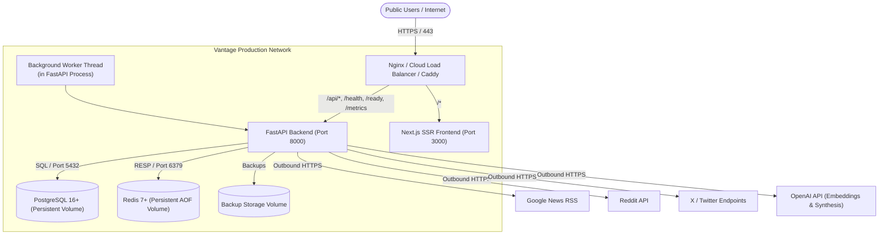

# VantageNews Production Deployment & Operations Guide

This guide provides step-by-step instructions for deploying and operating VantageNews in a production hosting environment.

---

## 1. Hosting Architecture Overview



### Components:
1. **Frontend**: Next.js 14 Standalone SSR app (Node 20 Alpine).
2. **Backend**: FastAPI with async endpoints, background threads, and resilience boundaries.
3. **Database**: PostgreSQL 16+ with persistent volume and logical backup capabilities.
4. **Governance & Cache**: Redis 7+ for atomic rate limiting, concurrency leasing, and cost accounting.
5. **Gateway / Reverse Proxy**: Nginx with SSL termination, HTTP-to-HTTPS redirect, security headers, and compression.

---

## 2. Infrastructure Requirements

| Component | Minimum Specification | Recommended Production |
| :--- | :--- | :--- |
| **Compute (Host / VM)** | 2 vCPU, 4 GB RAM | 4 vCPU, 8 GB RAM |
| **Storage** | 20 GB SSD (NVMe preferred) | 50+ GB SSD |
| **Operating System** | Ubuntu 22.04 LTS / Debian 12 | Linux with Docker & Docker Compose v2 |
| **PostgreSQL** | PostgreSQL 16 Alpine | PostgreSQL 16 Managed (RDS / Cloud SQL / Supabase) |
| **Redis** | Redis 7.0 Alpine | Redis 7.0+ (Managed Redis / Upstash / AWS ElastiCache) |

---

## 3. Production Environment Variables Reference

Create `.env` in the project root on your production host (or configure via your cloud provider's Secrets Manager).

> [!IMPORTANT]
> Never commit actual secrets or `.env` files to git. Use strong, randomly generated keys for all API keys and database passwords.

### 3.1 Database & Redis
| Variable Name | Required | Default / Example | Purpose |
| :--- | :--- | :--- | :--- |
| `POSTGRES_USER` | Yes | `postgres` | Database admin user |
| `POSTGRES_PASSWORD` | Yes | *\<strong-random-password\>* | Database user password |
| `POSTGRES_DB` | Yes | `vantage_news` | Database name |
| `DATABASE_URL` | Yes | `postgresql://postgres:<PASS>@db:5432/vantage_news` | SQLAlchemy database connection URI |
| `GOVERNANCE_BACKEND` | Yes | `redis` | Governance store (`redis` or `memory`) |
| `REDIS_URL` | Yes | `redis://redis:6379/0` | Redis connection URI |
| `REDIS_KEY_PREFIX` | No | `vantage:gov:` | Namespace prefix for Redis keys |

### 3.2 Security & Authentication (RBAC Dual-Key Rotation)
| Variable Name | Required | Role / Scope | Purpose |
| :--- | :--- | :--- | :--- |
| `OPS_API_KEY` | Yes | `operator` | Primary key for triggering discovery, trends, and alert evaluation |
| `OPS_API_KEY_SECONDARY` | No | `operator` | Secondary key for zero-downtime key rotation |
| `ADMIN_API_KEY` | Yes | `admin` | Primary key for backups, worker control, and circuit resets |
| `ADMIN_API_KEY_SECONDARY` | No | `admin` | Secondary key for zero-downtime key rotation |
| `SECURITY_API_KEY` | Yes | `security_admin` | Primary key for viewing audit logs |
| `SECURITY_API_KEY_SECONDARY` | No | `security_admin` | Secondary key for zero-downtime key rotation |
| `ENABLE_OPS_CONTROLS` | Yes | Global | Set `true` to enforce operational auth |
| `CORS_ORIGINS` | Yes | Web | Comma-separated allowed frontend origins (e.g. `https://vantage.yourdomain.com`) |

### 3.3 AI & External Providers
| Variable Name | Required | Default | Purpose |
| :--- | :--- | :--- | :--- |
| `OPENAI_API_KEY` | Yes | *\<sk-proj-...\>* | OpenAI API key for embeddings and synthesis |
| `OPENAI_PERSPECTIVE_MODEL` | No | `gpt-4o-mini` | Model for multi-perspective synthesis |
| `EMBEDDING_PROVIDER` | Yes | `openai` | Embedding provider (`openai` or local) |
| `LLM_PROVIDER` | Yes | `openai` | LLM synthesis provider (`openai` or local) |
| `REDDIT_CLIENT_ID` | Optional | *\<id\>* | Reddit API Client ID |
| `REDDIT_CLIENT_SECRET` | Optional | *\<secret\>* | Reddit API Client Secret |
| `REDDIT_USER_AGENT` | Optional | `VantageNews/2.0.0` | Reddit custom user agent |

### 3.4 Frontend
| Variable Name | Required | Default / Example | Purpose |
| :--- | :--- | :--- | :--- |
| `NEXT_PUBLIC_API_URL` | Yes | `https://vantage.yourdomain.com/api` (or `/api`) | Public API endpoint for browser calls |
| `INTERNAL_API_URL` | No | `http://backend:8000` | Internal network endpoint for Next.js SSR |

---

## 4. Deployment Instructions

### Method A: Single-Host Docker Compose Deployment (Recommended)

1. **Clone repository onto the target host**:
   ```bash
   git clone https://github.com/CitrusCandy/VantageNews.git /opt/vantagenews
   cd /opt/vantagenews
   ```

2. **Configure production environment file**:
   ```bash
   cp backend/.env.example .env
   # Edit .env with your production credentials
   nano .env
   ```

3. **Build and start services**:
   ```bash
   docker compose -f docker-compose.prod.yml up -d --build
   ```

4. **Verify container status**:
   ```bash
   docker compose -f docker-compose.prod.yml ps
   ```

---

## 5. Verification & Health Probes

1. **Verify Liveness Probe**:
   ```bash
   curl -f http://localhost/health
   # Expected output: {"status":"healthy","service":"vantage-news-api"}
   ```

2. **Verify Readiness Probe (Database & Redis)**:
   ```bash
   curl -f http://localhost/ready
   # Expected output: {"status":"ready","database":"connected","governance":{"active_backend":"redis","is_healthy":true,"fallback_active":false},...}
   ```

3. **Verify Frontend**:
   ```bash
   curl -I http://localhost/
   # Expected output: HTTP/1.1 200 OK
   ```

4. **Start Background Worker Scheduler**:
   ```bash
   curl -X POST "http://localhost/api/workers/start?auto_discover=true" \
     -H "X-Admin-Key: <YOUR_ADMIN_API_KEY>"
   ```

5. **Run Disaster Recovery & Incident Readiness Verification**:
   ```bash
   docker compose -f docker-compose.prod.yml exec backend python scripts/incident_readiness.py
   docker compose -f docker-compose.prod.yml exec backend python scripts/disaster_recovery_check.py
   ```

---

## 6. Maintenance, Updates & Rollbacks

### Zero-Downtime Rolling Update:
```bash
git fetch origin
git checkout v1.0.1  # or target commit
docker compose -f docker-compose.prod.yml build
docker compose -f docker-compose.prod.yml up -d --no-deps backend frontend
```

### Creating an On-Demand Database Backup:
```bash
curl -X POST "http://localhost/api/ops/backups/create" \
  -H "X-Admin-Key: <YOUR_ADMIN_API_KEY>"
```

### Restoring from Backup:
```bash
docker compose -f docker-compose.prod.yml exec backend python -m app.database.restore --latest --confirm
```
